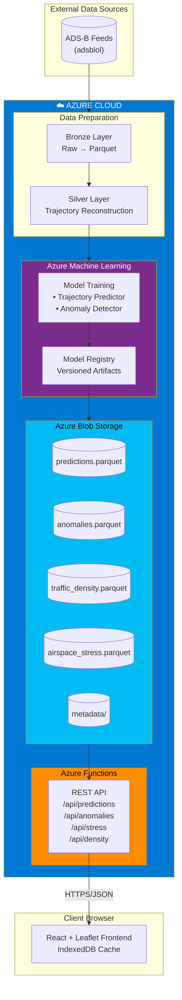
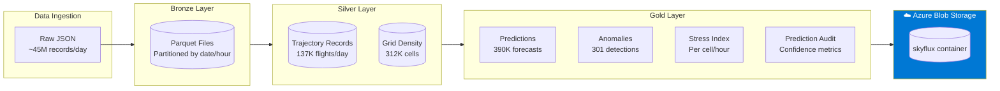
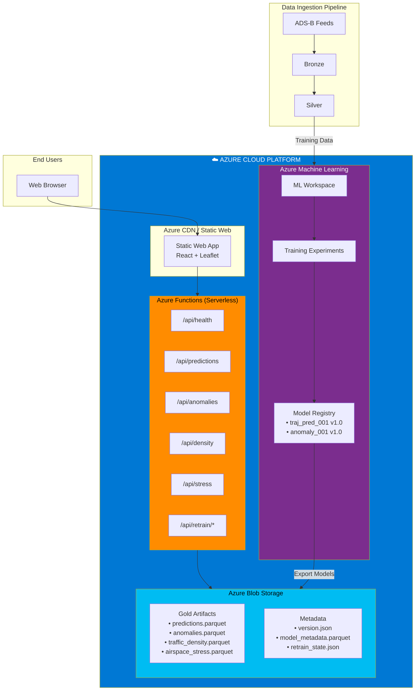
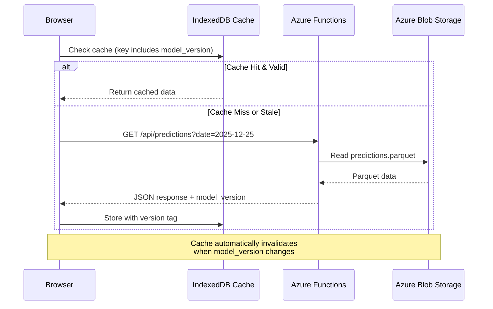
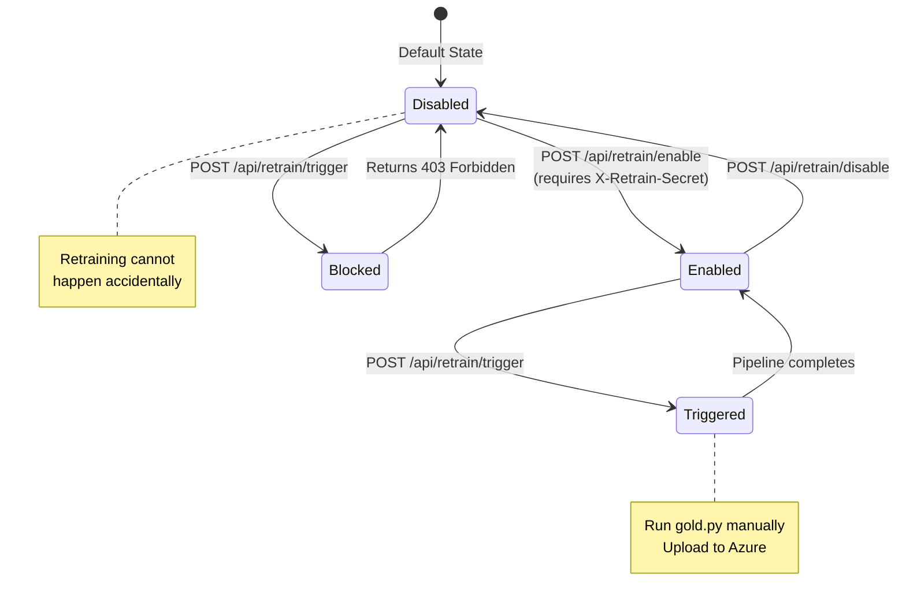

# SkyFlux AI

**Flight Data Analytics Platform with ML-Powered Predictions & Anomaly Detection**

SkyFlux AI is a comprehensive aviation analytics system that processes ADS-B (Automatic Dependent Surveillance-Broadcast) flight data through a medallion architecture pipeline, generating predictions, detecting anomalies, and computing airspace stress metrics.

---

## Table of Contents

1. [System Overview](#system-overview)
2. [Architecture](#architecture)
3. [Data Pipeline](#data-pipeline)
4. [Backend API](#backend-api)
5. [Frontend Application](#frontend-application)
6. [ML Models](#ml-models)
7. [Quick Start](#quick-start)
8. [Operational Workflows](#operational-workflows)
9. [Configuration](#configuration)
10. [Limitations](#limitations)

---

## System Overview

### What It Does

| Capability | Description |
|------------|-------------|
| **Trajectory Prediction** | Forecasts aircraft positions at 60/120/300 second horizons |
| **Anomaly Detection** | Identifies unusual flight behavior (route, altitude, speed deviations) |
| **Traffic Density** | Computes grid-based congestion metrics with historical percentiles |
| **Airspace Stress** | Composite risk index combining density, variance, and conflicts |
| **Time Travel** | Animated playback of historical flight data |
| **Model Registry** | Tracks ML model versions and training metadata |

### Key Characteristics

- **Batch Processing**: Not real-time; processes historical data
- **Read-Only Backend**: APIs serve pre-computed artifacts
- **Client-Side Rendering**: Heavy lifting on frontend for responsiveness
- **Manual Retraining**: Models updated only on explicit trigger

---

## Architecture

### High-Level System Architecture



### Data Flow Architecture



### Cloud Deployment Architecture



### API Request Flow



### Retraining Control Flow



---

## Data Pipeline

### Medallion Architecture

#### Bronze Layer (`pipeline/bronze.py`)

**Purpose**: Convert raw JSON to efficient Parquet format

```bash
python -m pipeline.bronze --input ./data/raw --output ./data/bronze
```

| Input | Output | Key Operation |
|-------|--------|---------------|
| Gzipped JSON from adsblol | Parquet files by date/hour | Decompression, schema normalization |

#### Silver Layer (`pipeline/silver.py`)

**Purpose**: Reconstruct trajectories and derive features

```bash
python -m pipeline.silver --input ./data/bronze --output ./data/silver
```

| Input | Output | Key Operations |
|-------|--------|----------------|
| Bronze Parquet | Trajectory records | Group by flight_id, compute speed/heading/vrate, build point arrays |

**Trajectory Record Schema**:
```json
{
  "flight_id": "A1B2C3_UAL123",
  "callsign": "UAL123",
  "points": [{"ts": 1735128000, "lat": 40.7, "lon": -74.0, "alt_ft": 35000, ...}],
  "duration_sec": 3600,
  "distance_nm": 450,
  "avg_speed_kts": 450
}
```

#### Gold Layer (`pipeline/gold.py`)

**Purpose**: Generate ML predictions and analytics artifacts

```bash
python -m pipeline.gold --input ./data/silver --output ./data/gold
```

| Artifact | Description | Size (Dec 25 sample) |
|----------|-------------|----------------------|
| `predictions.parquet` | Position forecasts at 60/120/300s horizons | 390K records |
| `anomalies.parquet` | Detected behavioral anomalies | 301 high-score |
| `traffic_density.parquet` | Grid-based congestion metrics | 312K cells |
| `airspace_stress.parquet` | Composite stress with components | Per cell/hour |
| `model_metadata.parquet` | Model versions and training info | 2 models |
| `version.json` | Data version, model version, training window | - |
| `prediction_audit.json` | Aggregate error metrics and confidence | - |
| `retrain_state.json` | Retraining control plane state | - |

---

## Backend API

### Endpoints

| Endpoint | Method | Description |
|----------|--------|-------------|
| `/api/health` | GET | System health and storage connectivity |
| `/api/metadata` | GET | Data version, date range, model list |
| `/api/predictions` | GET | Trajectory predictions with actual vs predicted |
| `/api/anomalies` | GET | Detected anomalies with explanations |
| `/api/density` | GET | Traffic density grid with scores |
| `/api/stress` | GET | Airspace stress with component breakdown |
| `/api/trajectories` | GET | Sampled trajectory points for time travel |
| `/api/prediction-quality` | GET | Prediction error metrics and confidence |
| `/api/retrain/status` | GET | Current retraining state |
| `/api/retrain/enable` | POST | Enable retraining (requires secret) |
| `/api/retrain/disable` | POST | Disable retraining (requires secret) |
| `/api/retrain/trigger` | POST | Trigger retraining (guarded) |

### Common Query Parameters

| Parameter | Type | Description |
|-----------|------|-------------|
| `date` | YYYY-MM-DD | Target date (defaults to latest) |
| `hour` | 0-23 | Hour of day |
| `limit` | int | Max records to return |
| `min_score` | float | Minimum anomaly score filter |
| `min_stress` | float | Minimum stress index filter |

### Response Format

All responses include:
```json
{
  "data_version": "v20260118--001",
  "model_version": 1,
  ...
}
```

---

## Frontend Application

### Views

| View | Description |
|------|-------------|
| **Map** | Interactive map with plane icons, predicted paths (dotted), actual paths (solid) |
| **Density** | Heatmap overlay showing traffic congestion with color gradients |
| **Anomalies** | Anomaly markers with explanation cards on click |
| **Stress Index** | Risk-level coloring (Low/Medium/High/Critical) with component breakdown |
| **Model Registry** | Grid of active ML models with versions and training dates |

### Features

| Feature | Description |
|---------|-------------|
| **Time Travel** | Slider to scrub through historical positions, animated playback |
| **Region Filter** | Global vs custom bounding box, client-side filtering |
| **What-If Analysis** | Adjust density/altitude parameters (experimental) |
| **Version-Aware Caching** | IndexedDB cache invalidates on model_version change |

### Tech Stack

- **UI Framework**: Vanilla JS + Vite
- **Mapping**: Leaflet.js with custom markers
- **State**: Simple store pattern (`stores/appState.js`)
- **Caching**: IndexedDB with TTL and version checks

---

## ML Models (Azure Machine Learning)

Models are trained in **Azure Machine Learning** workspace and registered in the Azure ML Model Registry. Trained artifacts are exported to Azure Blob Storage for serving via Azure Functions.

### Trajectory Prediction Model

| Property | Value |
|----------|-------|
| **ID** | `traj_pred_001` |
| **Type** | Dead reckoning (constant velocity) |
| **Horizons** | 60s, 120s, 300s |
| **Confidence** | Decays with horizon (1.0 → 0.3) |

**Prediction Formula**:
```
lat_new = lat + speed_deg_per_sec × horizon × cos(heading)
lon_new = lon + speed_deg_per_sec × horizon × sin(heading) / cos(lat)
alt_new = alt + vrate_fpm × (horizon / 60)
```

### Anomaly Detection Model

| Property | Value |
|----------|-------|
| **ID** | `anomaly_001` |
| **Type** | Isolation Forest |
| **Features** | duration, distance, max_alt, avg_speed, heading_change, climb/descent count |
| **Threshold** | 0.7 (for high-confidence anomalies) |

### Stress Index Components

| Component | Weight | Description |
|-----------|--------|-------------|
| `density_component` | 40% | Normalized flight count in grid cell |
| `maneuver_variance_component` | 35% | Combined altitude + speed variance |
| `heading_conflict_component` | 20% | Heading direction variance (potential conflicts) |
| `anomaly_component` | 5% | Presence of anomalous flights |

---

## Quick Start

### Prerequisites

- Python 3.10+
- Node.js 18+
- Azure Storage Account (or local data)

### 1. Setup Environment

```bash
# Clone and navigate
cd /Users/user/Desktop/SkyFlux\ AI

# Python virtual environment
cd pipeline
python3 -m venv venv
source venv/bin/activate
pip install -r requirements.txt

# Node dependencies
cd ../frontend
npm install
```

### 2. Configure Azure

Create `.env` in project root:
```bash
AZURE_STORAGE_ACCOUNT_NAME=skyfluxstore17jan
AZURE_STORAGE_CONNECTION_STRING=DefaultEndpointsProtocol=https;AccountName=...
AZURE_CONTAINER_NAME=skyflux
RETRAIN_SECRET=your-secret-here
```

### 3. Run Services

```bash
# Terminal 1: Backend
source pipeline/venv/bin/activate && source .env
python3 backend/local_server.py
# → http://localhost:5001

# Terminal 2: Frontend
cd frontend && npm run dev
# → http://localhost:3000
```

### 4. Open Application

Navigate to **http://localhost:3000**

---

## Operational Workflows

### Data Pipeline Execution

```bash
# Full pipeline run
source pipeline/venv/bin/activate

# 1. Bronze (raw → parquet)
python -m pipeline.bronze --input ./data/raw --output ./data/bronze

# 2. Silver (parquet → trajectories)
python -m pipeline.silver --input ./data/bronze --output ./data/silver

# 3. Gold (trajectories → ML artifacts)
python -m pipeline.gold --input ./data/silver --output ./data/gold

# 4. Sample trajectories for time travel
python pipeline/sample_trajectories.py

# 5. Upload to Azure
python pipeline/upload_gold.py
```

### Retraining Workflow

```bash
# Check status
curl http://localhost:5001/api/retrain/status

# Enable (requires secret)
curl -X POST -H "X-Retrain-Secret: $RETRAIN_SECRET" \
     http://localhost:5001/api/retrain/enable

# Trigger (blocked if disabled)
curl -X POST -H "X-Retrain-Secret: $RETRAIN_SECRET" \
     http://localhost:5001/api/retrain/trigger

# Run pipeline manually
python -m pipeline.gold --input ./data/silver --output ./data/gold
python pipeline/upload_gold.py

# Disable after completion
curl -X POST -H "X-Retrain-Secret: $RETRAIN_SECRET" \
     http://localhost:5001/api/retrain/disable
```

### Cache Management

Frontend cache automatically invalidates when `model_version` changes. Manual clear:
```javascript
// In browser console
indexedDB.deleteDatabase('skyflux-cache');
location.reload();
```

### Azure Resource Management

**Stop/Start the API to save costs:**

```bash
# STOP the Function App (saves costs when not in use)
az functionapp stop --name skyfluxapi --resource-group skyflux-rg

# START the Function App (reactivate when needed)
az functionapp start --name skyfluxapi --resource-group skyflux-rg

# Check current status
az functionapp show --name skyfluxapi --resource-group skyflux-rg --query "state" -o tsv
```

> **Note**: When stopped, the API returns errors. The static website (frontend) remains accessible but shows "Error loading data". Storage costs (~$0.02/mo) continue even when stopped.

---

## Configuration

### Pipeline Config (`pipeline/config.py`)

| Parameter | Default | Description |
|-----------|---------|-------------|
| `MAX_TRAJECTORIES` | 200 | Sampled trajectories for time travel |
| `GRID_SIZE` | 0.5° | Lat/lon grid cell size for density |
| `ANOMALY_THRESHOLD` | 0.7 | Minimum score for anomaly detection |

### Environment Variables

| Variable | Required | Description |
|----------|----------|-------------|
| `AZURE_STORAGE_CONNECTION_STRING` | Yes | Full connection string |
| `AZURE_CONTAINER_NAME` | Yes | Blob container name |
| `RETRAIN_SECRET` | Yes | Secret for retrain endpoints |

---

## Limitations

See [LIMITATIONS.md](./LIMITATIONS.md) for full details. Key points:

- **ADS-B Coverage**: Oceanic gaps, low-altitude blind spots
- **Batch Only**: No real-time streaming
- **Single-Day Sample**: Models trained on Dec 25, 2025 data
- **No Intent**: Cannot predict pilot decisions or ATC clearances
- **Stress ≠ Collision**: Stress index is not collision probability

---

## Project Structure

```
SkyFlux AI/
├── backend/
│   ├── local_server.py      # Flask development server
│   ├── function_app.py      # Azure Functions (production)
│   └── requirements.txt
├── frontend/
│   ├── index.html           # Main HTML
│   ├── src/
│   │   ├── main.js          # Entry point
│   │   ├── components/      # MapView, AnomalyCards
│   │   ├── services/        # API, cache
│   │   └── stores/          # State management
│   └── package.json
├── pipeline/
│   ├── bronze.py            # Raw → Parquet
│   ├── silver.py            # Parquet → Trajectories
│   ├── gold.py              # Trajectories → ML artifacts
│   ├── sample_trajectories.py
│   ├── schemas.py           # PyArrow schemas
│   └── config.py
├── data/
│   ├── bronze/              # Partitioned Parquet
│   ├── silver/              # Trajectory records
│   └── gold/                # ML outputs
├── .env                     # Azure credentials
├── LIMITATIONS.md           # Known limitations
└── README.md                # This file
```

---

## License

Internal use only. Not certified for aviation operations.

---

*Built with Azure Functions, Flask, Leaflet.js, and scikit-learn*